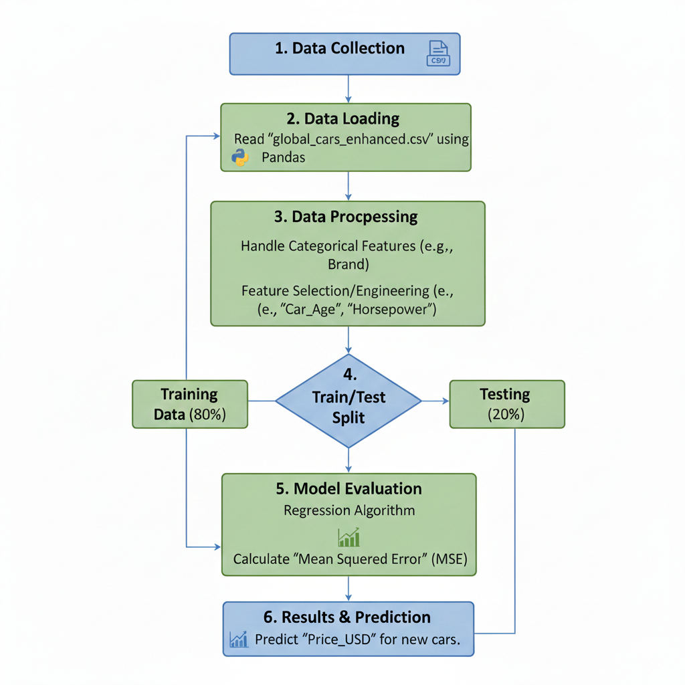

# Lab 2: Identifying ML Problems

## 1. Dataset Description
* **Dataset Name**: Global Cars Enhanced
* **Source**: Uploaded CSV file
* **Features**: Brand, Manufacture_Year, Fuel_Type, Engine_CC, Horsepower, and Car_Age.

## 2. Machine Learning Problem
* **Problem Type**: Regression
* **Target Variable**: Price_USD
* **Problem Statement**: The goal is to build a machine learning model to predict the car price (Price_USD) based on numerical features like Car_Age, Horsepower, and Engine_CC.

## 3. Methodology Diagram

